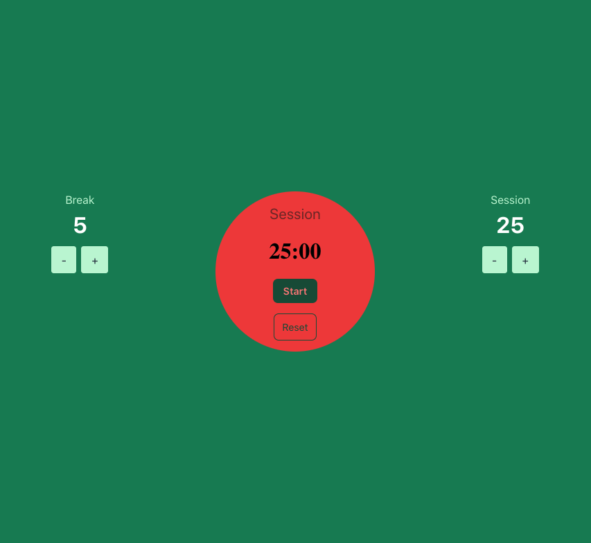

## TypeScript PomTimer

#### Description
This project was a self-study goal, with the attempt to make a project using TypeScript and React within a day. 

With the goal of better understanding TypeScript, and sharpening my React skills, I'd say I did pretty well. 

#### Interaction
To use this project, click the `+` or `-` buttons under the Session side to select how long you would like your timer to run.
The same applies to the Break section as well. 
The timer will give an `alarm` sound when the time of 0 is reached, and automatically start the break timer. 
These two will repeat back and forth until the stop button is clicked.

#### Images



#### Tech

```
TypeScript
React
Hooks
CSS
JSX
```

#### Mentions
Big thanks to @AryanJ-NYC for their youtube video that I followed fairly closely. Without them, I would probably be stuck with a non-working project.
